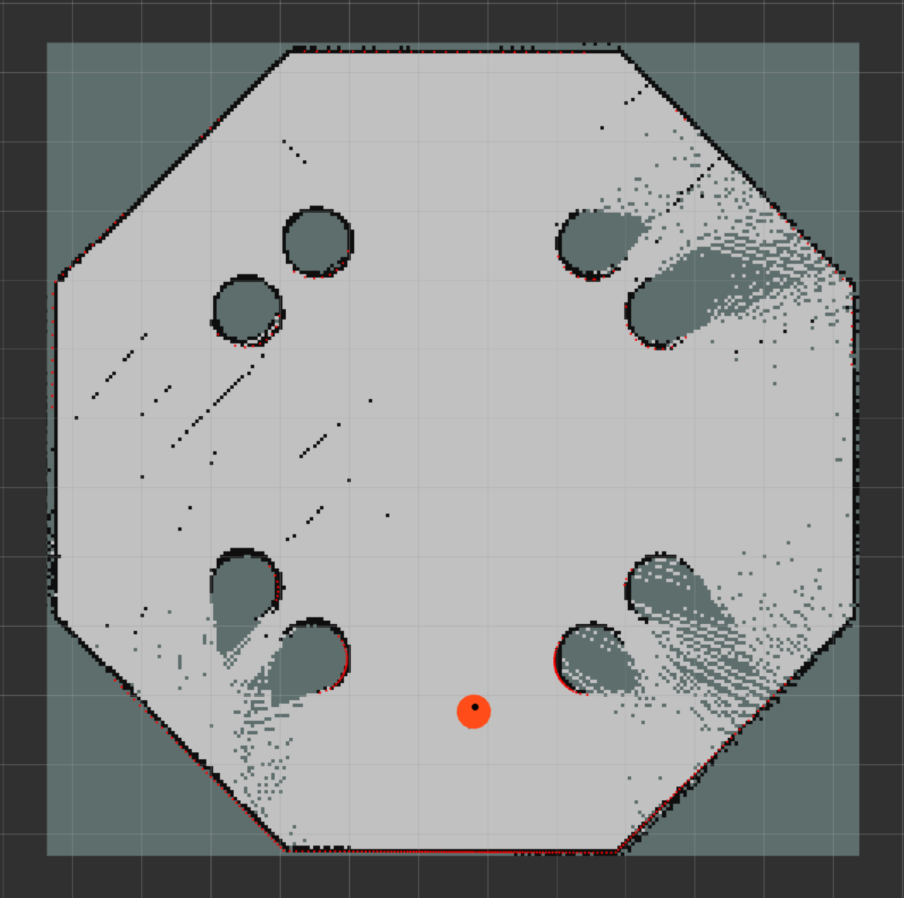

# State Estimation using Factor Graphs

This repository contains a robot state estimation using factor graphs. The demo consists of a simple robot that moves in a 2D space. It is equipped with sensors for odometry and localization.

The robot is controlled using a differential drive system, implemented with the Navigation2 stack. The state estimation is done using the GTSAM library. For comparison, the AMCL (Adaptive Monte Carlo Localization) localization node is also used. The simulation is done in Gazebo.

<br>
<div align="center">
  
  <br><br>
  <em>Robot state estimation (red vector: AMCL, blue: GTSAM).</em>
</div>
<br>

## Project Structure

The project is divided into two packages:

- `robot_simulation`: contains the xacro definition files of the robot, the AMCL localization, and navigation node launch files, and the Gazebo world files.
- `state_estimation`: contains the GTSAM state estimation node.

### Robot Simulation Package

The robot is equipped with a lidar, an IMU (Inertial Measurement Unit), and wheel encoders. An EKF (Extended Kalman Filter) from the `robot_localization` package is used to fuse the odometry and IMU data to estimate the robot's pose.

The data collected from the lidar and the odometry sensors is used by the AMCL node to localize the robot in the environment. The AMCL node subscribes to the laser scan data (`/scan`) and the non-filtered odometry data (`/diff_cont/odom`) and publishes the estimated pose of the robot (`/amcl_pose`).

The robot is controlled using the Navigation2 stack. The `diff_drive_controller` is used to control the robot's velocity. The `nav2_controller` is used to navigate the robot to a goal position.

The description of the robot is defined in the `description` directory. The `launch` directory contains the launch files for the simulation and the localization node. The `maps` directory contains the map of the environment. The `worlds` directory contains the Gazebo world files. Configuration files are stored in the `config` directory.

<br>
<div align="center">
  
&nbsp; &nbsp; &nbsp; &nbsp;
  
  <br><br>
  <em>Custom robot model and the Gazebo world.</em>
</div>
<br>

### State Estimation Package

The `state_estimation` package contains a custom node that uses the GTSAM library to perform robot position estimation. The node subscribes to pose (`/amcl_pose`) and odometry (`/odometry/filtered`) topics, processes the data using GTSAM's factor graphs and optimization algorithms, and then publishes the pose estimate (`/gtsam_pose`).

## Set up the Environment

To run the simulation, you will need to have Docker installed on your machine. The project was developed using Docker version 26.1.1.

1. Clone the repository:

    ```bash
    git clone git@github.com:ikajdan/ros_differential_robot_simulation.git
    ```

2. Build the Docker image:

    ```bash
    ./build.sh
    ```

3. Run the container:

    ```bash
    ./run.sh
    ```

4. Build the workspace:

    ```bash
    colcon build --symlink-install
    ```

## Run the Simulation

To run the simulation, follow these steps:

1. Source the workspace:

    ```bash
    source ./install/setup.bash
    ```

2. Launch the simulation:

    ```bash
    ros2 launch robot_simulation sim.launch.py world:=./src/robot_simulation/worlds/main.world gui:=false
    ```

> [!NOTE]
> The initial startup of the simulation may take a while.

> [!TIP]
> To visualize the Gazebo simulation, omit the `gui:=false` argument.

3. Launch the AMCL localization node:

    ```bash
    ros2 launch robot_simulation localization.launch.py map:=./src/robot_simulation/maps/main.yaml
    ```

4. Launch the GTSAM state estimation node:
    ```bash
    ros2 run state_estimation state_estimation
    ```

5. (Optional) Run the navigation node:

    ```bash
    ros2 launch robot_simulation navigation.launch.py
    ```

6. Launch the RViz visualization tool:

    ```bash
    ros2 run rviz2 rviz2 -d ./src/robot_simulation/config/view_main.rviz --ros-args -p use_sim_time:=true
    ```

7. Set the initial pose of the robot in RViz.

<br>
<div align="center">
  
&nbsp; &nbsp; &nbsp; &nbsp;
  
  <br><br>
  <em>Initial pose set in RViz.</em>
</div>
<br>

> [!NOTE]
> Make sure to set the fixed frame to `map` in RViz.

## World Mapping

To create a map of the environment, use the `slam_toolbox` package:

```bash
ros2 launch robot_simulation slam.launch.py
ros2 run rviz2 rviz2 -d ./src/robot_simulation/config/view_map.rviz --ros-args -p use_sim_time:=true
```

This will launch the `slam_toolbox` node and RViz. Use the `teleop_twist_keyboard` package to move the robot around the environment and create the map:

```bash
ros2 run teleop_twist_keyboard teleop_twist_keyboard --ros-args -r /cmd_vel:=/diff_cont/cmd_vel_unstamped
```

<br>
<div align="center">
  
&nbsp; &nbsp; &nbsp; &nbsp;
  
  <br><br>
  <em>Mapping the environment using the "slam_toolbox" package.</em>
</div>
<br>

Once the map is created, save it using the dialog in RViz to the [maps](src/robot_simulation/maps) directory. The generated map will be saved in the `pgm` and `yaml` format.

<br>
<div align="center">
  
  <br><br>
  <em>Generated map of the environment.</em>
</div>
<br>

## References

The wast majority of the robot simulation code is based on the [Building a Mobile Robot](https://www.youtube.com/playlist?list=PLunhqkrRNRhYAffV8JDiFOatQXuU-NnxT) tutorial made by [Articulated Robotics](https://www.youtube.com/@ArticulatedRobotics).

The code for the GTSAM state estimation node is based on the following tutorial: [Factor Graphs and GTSAM](https://gtsam.org/tutorials/intro.html).

Other resources used in the development of this project include:
- https://automaticaddison.com/sensor-fusion-using-the-robot-localization-package-ros-2/
- https://classic.gazebosim.org/tutorials?tut=ros_gzplugins
- https://navigation.ros.org/setup_guides/sensors/setup_sensors.html


## License

This repository is licensed under the MIT License - see the [LICENSE](LICENSE) file for details.
